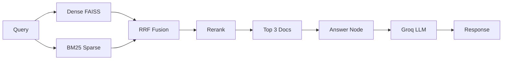

# 🚀 Real-Time RAG

### _Ask questions over a live stream of operational issues—answers grounded in up-to-date context, no restarts._

**Python • FastAPI • React • LangGraph • FAISS • Kafka • Groq**

**Purpose-Built Hybrid Retrieval with Real-Time Ingestion and Async Indexing**

Features • Architecture • Quick Start • API • Contributing

---

## 📖 Table of Contents

- [Overview](#-overview)
- [Key Features](#-key-features)
- [Architecture](#-architecture)
- [Tech Stack](#️-tech-stack)
- [Quick Start](#-quick-start)
- [Usage Guide](#-usage-guide)
- [API Documentation](#-api-documentation)
- [Project Structure](#-project-structure)
- [Pushing to GitHub](#-pushing-to-github)
- [Contributing](#-contributing)
- [License](#-license)
- [Acknowledgments](#-acknowledgments)

---

## 🌟 Overview

**Real-Time RAG** is a full-stack retrieval-augmented generation system that keeps your knowledge base **live**. Operational issues (alerts, incidents, delays) flow in via a message stream, get indexed in a vector store without blocking the API, and users ask natural-language questions—getting answers grounded **only** in the retrieved documents.

### 🎯 The Problem

Operations and support teams face three critical challenges:

- 📚 **Information overload** — Alerts, logs, and tickets pour in from many sources; finding "what's going on" means scanning dashboards and tools.
- 🔄 **Stale RAG** — Classic RAG assumes a static corpus; new issues require re-indexing or server restarts to show up in answers.
- ⏱️ **Slow ingest under load** — If every logged issue triggers embedding + indexing in the API, latency spikes and throughput drops when volume grows.

### 💡 Our Solution

Real-Time RAG provides:

- **📥 Async ingestion** — API publishes to Kafka and returns immediately; a background consumer does embedding and indexing so the system stays fast and scalable.
- **🔍 Hybrid retrieval** — Dense (FAISS) + sparse (BM25) with RRF fusion and rerank so answers use the best mix of semantic and keyword match.
- **📡 Always-fresh context** — Retrieve step loads the latest index from disk on every query, so new issues appear in answers without restarting anything.
- **🎯 Grounded answers** — The LLM is prompted to use **only** the provided context, so responses are traceable and factual.

---

## ✨ Key Features

**📥 Real-Time Ingestion**

- **Kafka-backed** event stream (`live_issues` topic)
- **Fast API** — `POST /log_issue` only publishes and returns; no blocking on embedding or indexing
- **Durable queue** — Messages buffered if the consumer is down; process when ready
- **Scalable** — Multiple producers can log issues; one or more consumers handle indexing

**🔍 Hybrid Retrieval Pipeline**

| Step | Component | Purpose |
|------|------------|---------|
| 1 | **Dense (FAISS)** | Semantic search with query embedding → top 5 |
| 2 | **Sparse (BM25)** | Keyword search over document texts → top 5 |
| 3 | **RRF** | Reciprocal Rank Fusion to merge both rankings fairly |
| 4 | **Rerank** | Query-term overlap to boost docs that contain query words |
| 5 | **Top 3** | Final context passed to the LLM for generation |

**🧠 LangGraph Orchestration**

- **Two-node graph**: `retrieve` → `answer`
- **Retrieve node** — Loads latest VectorStore from disk, runs dense + BM25 + RRF + rerank, returns top 3 doc strings
- **Answer node** — Builds context from docs, calls Groq LLM with an operations-analyst prompt, returns the answer

**🖥️ Simple React UI**

- **Ask panel** — Type a question, get an answer grounded in live issues
- **Plain-text API** — `POST /ask` with body as raw query string
- **CORS** — Frontend (Vite dev server) talks to FastAPI on port 8000

---
<p float="left">
  
  
</p>

*Backend FastAPI API (left) | Frontend React UI (right)*


## 🏗️ Architecture

### System Overview

```
                    INGESTION (async)                    QUERY (sync)
┌─────────────────────────────────────────┐   ┌─────────────────────────────────────────┐
│  Client  →  POST /log_issue  →  FastAPI │   │  User  →  React  →  POST /ask           │
│       →  Kafka (live_issues)            │   │       →  LangGraph [retrieve → answer]   │
│                                         │   │       →  Groq  →  answer                 │
│  Consumer  ←  Kafka  ←  embed + FAISS   │   │  retrieve: dense + BM25 + RRF + rerank    │
│       →  persist to disk                │   │  answer: context + LLM                   │
└─────────────────────────────────────────┘   └─────────────────────────────────────────┘
```

### Retrieval Pipeline



*(If your GitHub doesn't render Mermaid, the flow is: Query → Dense + BM25 → RRF → Rerank → Top 3 → Answer node → Groq → Response.)*

### Agent Pipeline (LangGraph)

| Node | Input | Output |
|------|--------|--------|
| **retrieve** | `query` | `docs` (top 3 text strings) |
| **answer** | `query`, `docs` | `answer` (LLM response) |

---

## 🛠️ Tech Stack

### Frontend

**React** • **Vite** • JavaScript (ES modules)

### Backend & AI

- **FastAPI** — REST API, CORS, `/ask`, `/log_issue`, `/documents`
- **LangGraph** — Retrieve → Answer graph with shared state
- **Sentence Transformers** — `all-MiniLM-L6-v2` (384-d) for embeddings
- **FAISS** — Vector index (in-memory, persisted to disk)
- **rank_bm25** — BM25 sparse retrieval
- **Groq** — LLM inference (`llama-3.1-8b-instant`)

### Data & Stream

- **Apache Kafka** (Redpanda) — Topic `live_issues`; producer in API, consumer for indexing
- **Persistence** — `data/faiss.index`, `data/docs.json`, `data/version.txt`

### Libraries & Tools

- **Uvicorn** — ASGI server
- **python-dotenv** — Environment variables (e.g. `GROQ_API_KEY`)
- **kafka-python** — Producer and consumer clients

---

## 🚀 Quick Start

### Prerequisites

- **Python** >= 3.10
- **Node.js** (for frontend)
- **Docker** (for Redpanda / Kafka)
- **Groq API key** — [Groq](https://groq.com/)

### Installation

1️⃣ **Clone the repository**

```bash
git clone https://github.com/yourusername/realtimerag.git
cd realtimerag/rag
```

2️⃣ **Create a virtual environment and install Python dependencies**

```bash
python -m venv venv
source venv/bin/activate   # Windows: venv\Scripts\activate
pip install fastapi uvicorn langgraph faiss-cpu sentence-transformers groq kafka-python rank-bm25 python-dotenv
```

3️⃣ **Set up environment variables**

Create `rag/.env`:

```env
GROQ_API_KEY=your_groq_api_key_here
```

4️⃣ **Start Kafka (Redpanda)**

```bash
docker compose -f rag/docker-compose.yaml up -d
```

5️⃣ **Start the backend**

```bash
cd rag
uvicorn app.main:app --reload --host 0.0.0.0 --port 8000
```

6️⃣ **Start the Kafka consumer** (in a second terminal)

```bash
cd rag
python -m stream.consumer
```

7️⃣ **Start the frontend** (in a third terminal)

```bash
cd rag/frontend
npm install
npm run dev
```

8️⃣ **Open your browser**

```
http://localhost:5173
```

### Production Build

**Backend:** run with a process manager (e.g. Gunicorn + Uvicorn workers).  
**Frontend:** `cd rag/frontend && npm run build` then serve the `dist/` folder.

---

## 📚 Usage Guide

### 1. Log an issue (ingest)

Send a `POST` request to `/log_issue` (e.g. from a script, monitoring tool, or API client):

```json
{
  "type": "outage",
  "text": "Database replica lag exceeding 5 seconds in region us-east-1",
  "metadata": { "source": "cloudwatch" }
}
```

The API publishes to Kafka and returns immediately. The **consumer** (step 6 above) will embed and index the text so it appears in future answers.

### 2. Ask a question

In the React UI:

- Type your question in the text area (e.g. *"What database issues have been reported?"*).
- Click **Ask**.
- The app calls `POST /ask` with your question as plain text; the backend runs **retrieve** (dense + BM25 + RRF + rerank) then **answer** (Groq), and displays the result.

### 3. List indexed documents (optional)

- **GET** `/documents` returns all documents currently in the store (useful for debugging or inspection).

### 4. Run all three processes

For a full experience:

- **Terminal 1:** `uvicorn app.main:app --reload --port 8000`
- **Terminal 2:** `python -m stream.consumer`
- **Terminal 3:** `cd rag/frontend && npm run dev`

Then log an issue (e.g. with `curl` or Postman) and ask a question in the browser—the new issue should be included in the context for the answer.

---

## 🔌 API Documentation

### Ask a question

**POST** `/ask`  
**Content-Type:** `text/plain`  
**Body:** Raw string (the question).

**Example:**

```bash
curl -X POST http://127.0.0.1:8000/ask \
  -H "Content-Type: text/plain" \
  -d "What delays or outages were reported today?"
```

**Response:** JSON with the LLM answer.

```json
{
  "answer": "Based on the context, ..."
}
```

*(Exact key may be `answer` or nested under graph output; frontend handles both.)*

---

### Log an issue

**POST** `/log_issue`  
**Content-Type:** `application/json`  
**Body:**

```json
{
  "type": "outage",
  "text": "Description of the issue or alert.",
  "metadata": {}
}
```

**Response:**

```json
{
  "status": "logged",
  "event": {
    "type": "outage",
    "text": "Description of the issue or alert.",
    "metadata": {},
    "timestamp": "2026-02-07T12:00:00.000000"
  }
}
```

---

### List documents

**GET** `/documents`  
**Response:** JSON array of all documents in the current store (for debugging).

---

## 📁 Project Structure

```
realtimerag/
├── rag/
│   ├── app/
│   │   ├── main.py              # FastAPI app, /documents, /ask, CORS
│   │   └── issues.py            # POST /log_issue → Kafka producer
│   ├── agents/
│   │   ├── graph.py             # LangGraph: retrieve → answer
│   │   ├── nodes.py             # retrieve_node, answer_node
│   │   └── state.py             # RAGState (query, docs, answer)
│   ├── core/
│   │   ├── embeddings.py        # SentenceTransformer (all-MiniLM-L6-v2)
│   │   ├── vector_store.py      # FAISS + DocumentStore, load/save
│   │   ├── document_store.py
│   │   └── persistence.py       # save/load index + docs + version
│   ├── retrieval/
│   │   ├── dense.py             # DenseRetriever (FAISS)
│   │   ├── bm.py                # SparseRetriever (BM25)
│   │   ├── rrf.py               # RRF fusion
│   │   └── rerank.py            # simple_rerank (query-word overlap)
│   ├── stream/
│   │   ├── producer.py          # Kafka producer, send_issue_event()
│   │   └── consumer.py          # Kafka consumer → add_document()
│   ├── data/                    # faiss.index, docs.json, version.txt
│   ├── config.py                # EMBEDDING_MODEL, LLM_MODEL, TOP_K
│   ├── requirements.txt
│   ├── docker-compose.yaml      # Redpanda on 9092
│   └── frontend/                # React + Vite
│       ├── src/
│       │   ├── App.jsx
│       │   ├── api.js           # askQuestion() → POST /ask
│       │   └── components/       # Header, AskPanel
│       └── package.json
└── README.md                    # This file
```

---

## 📤 Pushing to GitHub

Follow these steps to put the project on GitHub (first time).

1. **Initialize git** (from project root `realtimerag/`):

   ```bash
   cd c:\Users\kriss\OneDrive\Desktop\realtimerag
   git init
   ```

2. **Stage and commit**:

   ```bash
   git add .
   git status   # check that .env and meenv/ are not listed
   git commit -m "Initial commit: Real-Time RAG with FastAPI, LangGraph, Kafka, React"
   ```

3. **Create a new repo on GitHub** — Go to [github.com/new](https://github.com/new), name it e.g. `realtimerag`, leave it empty (no README/license).

4. **Add remote and push** (replace `YOUR_USERNAME` and `realtimerag` with your repo):

   ```bash
   git remote add origin https://github.com/YOUR_USERNAME/realtimerag.git
   git branch -M main
   git push -u origin main
   ```

If you use SSH: `git remote add origin git@github.com:YOUR_USERNAME/realtimerag.git`

---

## 🤝 Contributing

We welcome contributions. Suggested steps:

1. **Fork** the repository.
2. **Create** a feature branch (`git checkout -b feature/your-feature`).
3. **Commit** your changes (`git commit -m 'Add your feature'`).
4. **Push** to the branch (`git push origin feature/your-feature`).
5. **Open** a Pull Request.

- Keep `.env` and secrets out of commits.
- Add or update tests and docs as needed for new behavior.

---

## 🐛 Bug Reports & Feature Requests

Open an issue with:

- A **clear title** and description
- **Steps to reproduce** (for bugs)
- **Expected vs actual behavior**
- **Environment** (OS, Python/Node versions)

---

## 📄 License

This project is licensed under the **MIT License** — use and adapt as needed. See the LICENSE file for details.

---

## 🙏 Acknowledgments

- **[FastAPI](https://fastapi.tiangolo.com/)** for the modern Python API framework
- **[LangChain / LangGraph](https://langchain-ai.github.io/langgraph/)** for the retrieve–answer orchestration
- **[FAISS](https://github.com/facebookresearch/faiss)** for efficient vector search
- **[Groq](https://groq.com/)** for fast LLM inference
- **[Redpanda](https://redpanda.com/)** for Kafka-compatible streaming
- **Open source community** for the libraries that power this stack

---

### ⭐ Star us on GitHub — it helps others find Real-Time RAG!

**Made with ❤️ for ops and support teams who need answers from live data.**

---

**Real-Time RAG** © 2026 • Ask questions over a live stream of issues—grounded, up-to-date answers.
