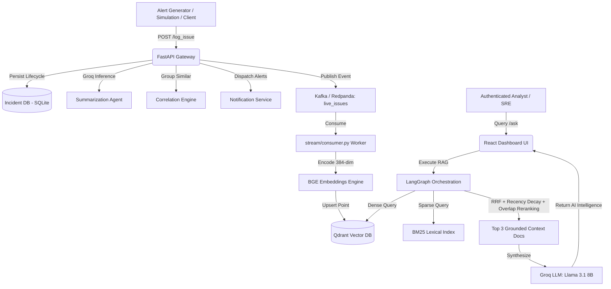

# Real-Time Incident Intelligence Platform

**Version 2.0.0**

A production-inspired Retrieval-Augmented Generation (RAG) system for engineering and operations teams to monitor, investigate, and understand operational incidents in real time.

Unlike traditional RAG systems that rely on static documents, this platform continuously ingests incident events, indexes them with lifecycle metadata, and enables team-specific question answering through a secure dashboard.

> **Interview positioning:** Describe this as *"a production-inspired incident intelligence system demonstrating real-time ingestion, team-aware retrieval, hybrid search, authenticated access, analytics, and LLM-powered incident investigation workflows."*

---

## What This Platform Does

| Capability | Description |
|---|---|
| Real-time ingestion | Incidents flow through Kafka/Redpanda into the vector index |
| Incident lifecycle | `OPEN` -> `INVESTIGATING` -> `MITIGATED` -> `RESOLVED` -> `CLOSED` |
| Time-aware retrieval | Recency-weighted hybrid search (semantic + BM25 + decay) |
| Summarization agent | Auto-generates summary, root cause, impact, and recommendations |
| Smart correlation | Groups related incidents by service and error patterns |
| Similar incidents | "Have we seen this before?" via semantic search |
| Resolution recommendations | LLM suggestions from historical similar incidents |
| RCA generation | Automated Root Cause Analysis reports |
| Notifications | Web, Slack, Teams, and Email channels |
| RBAC | Admin, Team Lead, SRE, Engineer, and Analyst roles |
| Analytics | MTTR, severity distribution, top services, trends |
| Auto cleanup | Background job archives and purges expired incidents |
| Alert generator | Simulates 500+ realistic monitoring alerts |

---

## Architecture Flow


```mermaid
graph TD
    A[Alert Generator / Simulation / Client] -->|POST /log_issue| B(FastAPI Gateway)
    B -->|Persist Lifecycle| C[(Incident DB - SQLite)]
    B -->|Groq Inference| D[Summarization Agent]
    B -->|Group Similar| E[Correlation Engine]
    B -->|Dispatch Alerts| F[Notification Service]
    B -->|Publish Event| G[Kafka / Redpanda: live_issues]
    
    G -->|Consume| H[stream/consumer.py Worker]
    H -->|Encode 384-dim| I[BGE Embeddings Engine]
    I -->|Upsert Point| J[(Qdrant Vector DB)]

    K[Authenticated Analyst / SRE] -->|Query /ask| L(React Dashboard UI)
    L -->|Execute RAG| M[LangGraph Orchestration]
    M -->|Dense Query| J
    M -->|Sparse Query| N[BM25 Lexical Index]
    M -->|RRF + Recency Decay + Overlap Reranking| O[Top 3 Grounded Context Docs]
    O -->|Synthesize| P[Groq LLM: Llama 3.1 8B]
    P -->|Return AI Intelligence| L
```

---

## Tech Stack & Versions

### Backend
| Component | Technology | Version |
|---|---|---|
| API Gateway | FastAPI | >= 0.115 |
| AI Orchestration | LangGraph | >= 0.2.0 |
| LLM Engine | Groq (llama-3.1-8b-instant) | >= 0.13.0 |
| Embedding Engine | BAAI/bge-small-en-v1.5 (SentenceTransformers) | >= 3.3.0 |
| Vector DB | **Qdrant** (default) or FAISS (optional fallback) | Qdrant v1.18+ / faiss-cpu |
| Lexical Search | rank-bm25 | >= 0.2.2 |
| Stream Processing| Kafka-python + Redpanda | v24.2+ |
| Relational Storage | SQLAlchemy + SQLite | >= 2.0.0 |
| Identity & Auth | Supabase + JWT Security Middleware | >= 2.10.0 |
| Job Scheduling | APScheduler | >= 3.10.0 |

### Frontend
| Component | Technology | Version |
|---|---|---|
| UI Engine | React | 19.x |
| Build Tooling | Vite | Latest |
| Client Routing | React Router | Latest |
| Auth & Security | Supabase JS Client | Latest |
| Design & Styling | Tailwind CSS + Vanilla Custom Tokens | — |

---

## Service Ports & Networking Configuration

During local development and testing, the microservice ecosystem communicates across the following port mapping architecture:

| Service | Port | Protocol | Purpose / URL |
|---|---|---|---|
| **React Dashboard** | `5173` | HTTP / WebSocket | Main Frontend UI Command Center (`http://localhost:5173`) |
| **FastAPI Gateway** | `8000` | HTTP / OpenAPI | Main Backend RAG API Gateway (`http://localhost:8000/docs`) |
| **Qdrant Vector DB** | `6333` | HTTP / REST | Vector database HNSW indexing & semantic hybrid point queries |
| **Qdrant Vector DB** | `6334` | gRPC | High-performance internal binary vector stream RPC communication |
| **Qdrant Dashboard** | `6333` | HTTP / Web UI | Built-in Visual DB Management UI (`http://localhost:6333/dashboard`) |
| **Redpanda Broker** | `9092` | Kafka Protocol | Event pub/sub topic streaming broker (`live_issues`) |
| **SQLite DB** | *Local File* | ACID DB Engine | Embedded local transactional database (`rag/rag_analytics.db`) |

---

## Project Structure

```text
rag/
+-- agents/              # LangGraph pipeline (retrieve, answer, summarize)
+-- app/                 # FastAPI routes (auth, issues, incidents, analytics, admin)
+-- core/                # Vector store, incidents, notifications, correlation, summarizer
|   +-- vector_backends/ # Qdrant (default) + FAISS (fallback)
+-- retrieval/           # Dense, BM25, RRF, rerank, recency
+-- stream/              # Kafka producer + consumer
+-- simulation/          # Alert generator
+-- jobs/                # Background cleanup scheduler
+-- frontend/            # React SPA Dashboard
+-- docs/                # Comprehensive Interview Prep Deep-Dive documentation suite
+-- data/                # FAISS files only when VECTOR_BACKEND=faiss
+-- scripts/             # Migration utilities (migrate_faiss_to_qdrant.py)
+-- docker-compose.yaml  # Redpanda + Qdrant container configurations
+-- config.py            # Global system hyper-parameters and environment getters
+-- requirements.txt     # Python backend package dependencies
```

---

## API Endpoints Reference

### Authentication
| Method | Path | Description |
|---|---|---|
| POST | `/register` | Create user and profile with verified team label and role assignment |

### Incidents & Ingestion
| Method | Path | Description |
|---|---|---|
| POST | `/log_issue` | Ingest real-time incident (lifecycle + Kafka topic + automatic AI summarization) |
| GET | `/incidents` | List incidents (support filtering by status, severity, and team tags) |
| GET | `/incidents/{id}` | Detailed incident analysis + timeline events + correlated incidents |
| PATCH | `/incidents/{id}/status` | Execute lifecycle state transitions |
| PATCH | `/incidents/{id}/summary` | Override or update AI summary fields (Requires SRE role or above) |
| GET | `/incidents/{id}/similar` | Perform semantic similarity lookup for historical occurrences |
| GET | `/incidents/{id}/rca` | Generate interactive Root Cause Analysis report |
| DELETE | `/issues/{id}` | Delete incident record (Restricted to original owner or admin) |

### RAG & AI Intelligence
| Method | Path | Description |
|---|---|---|
| POST | `/ask` | Team-aware Hybrid RAG conversational Q&A (supports status/severity filters) |
| POST | `/summarize` | Generate intelligent executive summary across incidents matching a topic query |
| POST | `/recommend` | Extract actionable operational resolution suggestions from historical incidents |
| GET | `/documents` | List indexed text documents (requires JWT authentication, team-scoped) |

### Notifications
| Method | Path | Description |
|---|---|---|
| GET | `/notifications` | Poll web dashboard emergency notifications |
| POST | `/notifications/{id}/read` | Mark individual alert notification as acknowledged/read |

### Simulation Engine
| Method | Path | Description |
|---|---|---|
| POST | `/simulation/generate?count=N` | Trigger bulk automated alert generation test storms |
| POST | `/simulation/single` | Inject a single random high-fidelity synthetic monitoring alert |

### Analytics & Observability
| Method | Path | Description |
|---|---|---|
| GET | `/analytics/dashboard` | Aggregation endpoint for MTTR, severity heatmaps, and top services |
| GET | `/analytics/mttr` | Calculate Mean Time To Resolution metrics over time |
| GET | `/analytics/severity` | Breakdown active incident severity distributions |
| GET | `/analytics/services` | Identify most degraded or alert-heavy microservices |

### System Admin
| Method | Path | Description |
|---|---|---|
| POST | `/admin/reset` | Purge relational tables and reset vector indexes (Restricted to admin) |
| POST | `/admin/cleanup` | Manually trigger daily data retention and cleanup job (Restricted to admin) |

---

## Incident Lifecycle

```json
{
  "incident_id": "a1b2c3d4-e5f6-7a8b",
  "status": "OPEN",
  "severity": "critical",
  "service": "payment-service",
  "created_at": "2026-08-01T10:00:00",
  "resolved_at": null,
  "summary": "AI Generated Executive Summary...",
  "root_cause": "Database connection pool starvation caused by uncommitted retry loops.",
  "impact": "Payment checkout service failing with HTTP 500 across EU regions.",
  "recommendation": "Restart connection proxy and apply circuitbreaker rate-limiting."
}
```

**State Machine Progression:** `OPEN` -> `INVESTIGATING` -> `MITIGATED` -> `RESOLVED` -> `CLOSED`

**Example Natural Language RAG Queries:**
- *"Show me all open critical database incidents from today."*
- *"What Kubernetes deployment errors were resolved this week?"*
- *"Have we experienced connection pool starvation on payment-service before?"*

---

## Time-Aware Hybrid Retrieval Math

When an analyst initiates an AI interrogation, candidate incident documents are scored across three complementary scoring methodologies:

```text
Final Score = (0.5 * Semantic Cosine Similarity) + (0.3 * BM25 TF-IDF Keyword Rank) + (0.2 * Temporal Recency Decay Weight)
```

**Default Temporal Recency Expiry Windows (`config.py`):**
| Severity Level | Expiration Tolerance Window |
|---|---|
| Critical | 90 Days |
| High | 60 Days |
| Medium / Normal / Low | 30 Days |

---

## RBAC Role Hierarchy

| Role | Operational Permissions & Boundaries |
|---|---|
| **Analyst** | Read team incidents, query `/ask` AI dashboard, and observe analytics charts |
| **Engineer** | All Analyst rights + log real-time issues and delete self-authored alerts |
| **SRE** | All Engineer rights + update AI incident summaries and execute lifecycle state machine shifts |
| **Team Lead** | All SRE rights + cross-team visibility access across different operational domains |
| **Admin** | Unrestricted global access + trigger manual database cleanup sweeps or factory resets |

---

## Environment Configuration

### Backend Setup (`rag/.env`)

```env
GROQ_API_KEY=your_groq_api_key
SUPABASE_URL=your_supabase_url
SUPABASE_SERVICE_ROLE_KEY=your_service_role_key
SUPABASE_JWT_SECRET=your_jwt_secret

# Vector Database (Qdrant is configured as production default)
VECTOR_BACKEND=qdrant
QDRANT_HOST=localhost
QDRANT_PORT=6333
QDRANT_COLLECTION=incidents

# Embedding Engine Hyperparameters
EMBEDDING_MODEL=BAAI/bge-small-en-v1.5
EMBEDDING_DIM=384

# Optional Alert Notification Dispatch Channels
SLACK_WEBHOOK_URL=
TEAMS_WEBHOOK_URL=
SMTP_HOST=
SMTP_USER=
SMTP_PASSWORD=

# Optional LangSmith Tracing & Telemetry
LANGCHAIN_TRACING_V2=true
LANGSMITH_PROJECT=incident-intelligence
LANGCHAIN_API_KEY=your_langchain_api_key
```

### Frontend Setup (`rag/frontend/.env`)

```env
VITE_SUPABASE_URL=your_supabase_url
VITE_SUPABASE_ANON_KEY=your_anon_key
```

---

## Quickstart Run Instructions

### 1. Install Dependencies
```bash
# Navigate to backend and install python dependencies
cd rag
python -m venv venv
venv\Scripts\activate        # On Windows
pip install -r requirements.txt

# Navigate to frontend and install JavaScript dependencies
cd frontend
npm install
```

### 2. Boot Docker Infrastructure
```bash
cd rag
docker compose up -d           # Launches Qdrant (6333) + Redpanda Kafka (9092)
```

### 3. Launch Application Microservices
Open three separate terminal sessions inside your `rag` workspace directory:

```bash
# Terminal 1: FastAPI RAG Gateway & APScheduler worker
cd rag
uvicorn app.main:app --reload --port 8000

# Terminal 2: Kafka stream background vector ingestion worker
cd rag
python -m stream.consumer

# Terminal 3: React Vite Single Page UI
cd rag/frontend
npm run dev
```

Open your browser to **http://localhost:5173**.
To inspect your vector database visually, open the **Qdrant Built-in UI at http://localhost:6333/dashboard**.

---

## Qdrant Production Setup vs FAISS Fallback

This repository utilizes **Qdrant Vector Database by default** due to enterprise multi-process concurrency requirements, zero-lock shared memory capabilities, and high-speed payload pre-filtering. FAISS code remains in the repository solely as a standalone CPU fallback option.

### Why Qdrant Overpowers FAISS In This Architecture
- **True Multi-Process Memory Access**: Both FastAPI (`main.py`) and our Kafka worker (`consumer.py`) query the same remote Qdrant service without file lock collisions or redundant filesystem index reloads.
- **Native Keyword Pre-Filtering**: Evaluates structured metadata fields (`team_tag`, `status`, `severity`) *before* running Cosine Similarity calculations.
- **Persistent Docker Volume Preservation**: Vector graph storage is safely persisted across server reboots via `qdrant_data`.

### Verification Commands
```bash
# Verify container execution status
docker ps | findstr qdrant

# Query Qdrant collections directly via HTTP REST
curl http://localhost:6333/collections

# Ping Application Admin Endpoint
curl http://localhost:8000/admin/vector-status
# Returns: { "backend": "qdrant", "document_count": N }
```

### One-Time FAISS Data Migration
If you possess legacy historical JSON archives inside `data/docs.json`, migrate them straight into Qdrant using our migration script:
```bash
cd rag
python -m scripts.migrate_faiss_to_qdrant
```

---

## Automated Retention & Database Cleanup

An automated **APScheduler** cron engine boots alongside FastAPI (`jobs/cleanup.py`), executing daily maintenance sweeps (configurable via `CLEANUP_INTERVAL_HOURS`):
1. Archives incident rows sitting in `RESOLVED` state beyond `RETENTION_DAYS_RESOLVED` (Default: 365 Days).
2. Purges stale vector points sitting in `CLOSED` state beyond `RETENTION_DAYS_CLOSED` (Default: 180 Days) to conserve vector DB RAM.
3. Compresses and cleans historical analytical request telemetry.

Manual cleanup triggering can be forced by an administrator via `POST /admin/cleanup`.

---

## Qdrant has a built-in web dashboard. Open this in your browser:

http://localhost:6333/dashboard