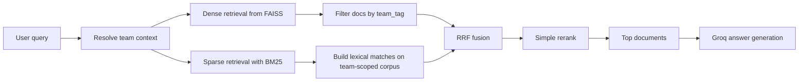

# Real-Time RAG

Real-Time RAG is a full-stack retrieval-augmented generation system for operational incidents. It ingests live issues, stores them in a local FAISS-backed knowledge base, filters context by team, and answers user questions through a secured React dashboard.

This project combines real-time ingestion, team-aware retrieval, authentication, and lightweight analytics in a single repo.

## What This Project Does

- Accepts incident or alert events through `POST /log_issue`
- Publishes events to Kafka/Redpanda for asynchronous ingestion
- Stores issue text as embeddings in FAISS with document metadata
- Filters retrieved context by the authenticated user's team
- Uses hybrid retrieval: dense search + BM25 + reciprocal rank fusion + reranking
- Generates answers with Groq using a team-specific system prompt
- Tracks issue and query analytics in local SQLite
- Provides a React frontend for login, querying, simulation, and analytics

## Core Features

### 1. Team-aware RAG

Each issue is tagged with a `team_tag`. During retrieval, the system filters documents so users only receive context relevant to their team or the team selected in the dashboard.

### 2. Real-time ingestion

The API logs issues immediately and sends them to the `live_issues` Kafka topic. A consumer reads those events and writes them into the local vector store without requiring an API restart.

### 3. Hybrid retrieval pipeline

The answer pipeline combines:

- Dense semantic retrieval from FAISS
- Sparse lexical retrieval with BM25
- Reciprocal Rank Fusion (RRF)
- Lightweight overlap-based reranking

This improves both semantic matching and exact keyword matching for operational queries.

### 4. Authenticated access

Supabase is used for:

- signup and login
- JWT-based authentication
- profile lookup
- team and role resolution

Protected routes are enforced in the frontend and protected endpoints are enforced in FastAPI dependencies.

### 5. Analytics dashboard

The app stores:

- query count
- issue count
- average response time
- average answer quality proxy
- top questions
- issue trends over time

Analytics are persisted in `rag_analytics.db` using SQLite and SQLAlchemy.

## Architecture

```text
Simulation / Client
        |
        v
  FastAPI /log_issue
        |
        v
 Kafka / Redpanda topic: live_issues
        |
        v
   stream/consumer.py
        |
        v
 Embeddings -> FAISS + docs.json

Authenticated User
        |
        v
 React frontend -> FastAPI /ask
        |
        v
 Auth middleware resolves user/team
        |
        v
 LangGraph:
   retrieve -> answer
        |
        v
 Groq LLM response
```

## Retrieval Flow


```mermaid
graph LR
    A["User query"] --> B["Resolve team context"]
    B --> C["Dense retrieval from FAISS"]
    B --> D["Sparse retrieval with BM25"]
    C --> E["Filter docs by team_tag"]
    D --> F["Build lexical matches on team-scoped corpus"]
    E --> G["RRF fusion"]
    F --> G
    G --> H["Simple rerank"]
    H --> I["Top documents"]
    I --> J["Groq answer generation"]
```

## Tech Stack

### Backend

- FastAPI for API endpoints and dependency-based auth
- LangGraph for orchestrating retrieve and answer stages
- Groq for low-latency LLM inference
- SentenceTransformers with `all-MiniLM-L6-v2` for embeddings
- FAISS for vector similarity search
- rank-bm25 for lexical retrieval
- SQLAlchemy + SQLite for analytics
- python-jose for JWT verification
- Supabase Python client for auth and profile access

### Frontend

- React 19
- Vite
- React Router
- Supabase JS client

### Streaming / Infra

- Kafka client library
- Redpanda via Docker Compose

## Project Structure

```text
rag/
+-- agents/
¦   +-- graph.py           # LangGraph definition
¦   +-- nodes.py           # retrieve_node and answer_node
¦   +-- state.py           # RAG state shape
+-- app/
¦   +-- analytics.py       # Analytics API routes
¦   +-- auth.py            # Supabase JWT + user resolution
¦   +-- issues.py          # Issue ingestion route
¦   +-- main.py            # FastAPI entrypoint
+-- core/
¦   +-- analytics.py       # SQLite analytics logic
¦   +-- document_store.py  # In-memory doc map
¦   +-- embeddings.py      # Embedding model loader
¦   +-- persistence.py     # Save/load FAISS and docs
¦   +-- vector_store.py    # Search + add document logic
+-- retrieval/
¦   +-- bm.py              # BM25 sparse retrieval
¦   +-- dense.py           # Dense retrieval wrapper
¦   +-- rerank.py          # Overlap-based reranking
¦   +-- rrf.py             # Reciprocal Rank Fusion
+-- stream/
¦   +-- consumer.py        # Kafka consumer and index updater
¦   +-- producer.py        # Kafka producer
+-- frontend/
¦   +-- src/
¦       +-- components/    # Login, signup, simulation, dashboards
¦       +-- api.js         # Frontend API helpers
¦       +-- App.jsx        # Routes
+-- data/                  # FAISS index, docs.json, version.txt
+-- config.py
+-- docker-compose.yaml
+-- requirements.txt
+-- rag_analytics.db
```

## API Summary

### `POST /register`

Creates a Supabase auth user and inserts a profile record with team information.

Request:

```json
{
  "email": "user@example.com",
  "password": "strong-password",
  "team": "devops"
}
```

### `POST /ask`

Authenticated endpoint for RAG queries.

- Body is plain text, not JSON
- Optional query param: `team_id`

Example:

```http
POST /ask?team_id=security
Authorization: Bearer <jwt>
Content-Type: text/plain

What are the most critical security incidents right now?
```

### `POST /log_issue`

Authenticated endpoint that logs a new incident and tags it with the current user's team.

Request:

```json
{
  "type": "alert",
  "text": "Database CPU usage is above 95% for five minutes",
  "metadata": {
    "severity": "critical",
    "source": "PagerDuty"
  }
}
```

### Analytics endpoints

- `GET /analytics/queries`
- `GET /analytics/issues`
- `GET /analytics/timeline`
- `GET /analytics/dashboard`
- `POST /admin/reset`

All of these require authentication.

## Frontend Pages

- `/login` for sign-in
- `/signup` for account creation
- `/ask` for direct question answering
- `/backend` for team-specific chat tabs
- `/simulation` for triggering sample incidents
- `/analytics` for metrics and reset actions

## Environment Variables

### Backend `.env`

Create `rag/.env`:

```env
GROQ_API_KEY=your_groq_api_key
SUPABASE_URL=your_supabase_url
SUPABASE_SERVICE_ROLE_KEY=your_supabase_service_role_key
SUPABASE_JWT_SECRET=your_supabase_jwt_secret

# Optional LangSmith tracing
LANGCHAIN_TRACING_V2=true
LANGSMITH_PROJECT=realtime-rag
LANGCHAIN_API_KEY=your_langsmith_api_key
```

### Frontend `frontend/.env`

```env
VITE_SUPABASE_URL=your_supabase_url
VITE_SUPABASE_ANON_KEY=your_supabase_anon_key
```

## How To Run

### 1. Backend dependencies

```bash
cd rag
python -m venv venv
venv\Scripts\activate
pip install -r requirements.txt
```

### 2. Frontend dependencies

```bash
cd rag/frontend
npm install
```

### 3. Start Redpanda

```bash
cd rag
docker compose up -d
```

### 4. Start the FastAPI server

```bash
cd rag
uvicorn app.main:app --reload --port 8000
```

### 5. Start the Kafka consumer

```bash
cd rag
python -m stream.consumer
```

### 6. Start the frontend

```bash
cd rag/frontend
npm run dev
```

Open `http://localhost:5173`.

## Typical User Flow

1. A user signs up and is mapped to a team such as `ops`, `devops`, or `security`.
2. The user logs in through Supabase.
3. The user triggers incidents from the simulation page or submits custom issues.
4. The backend sends those events to Kafka and records analytics.
5. The consumer reads the events and updates the vector index on disk.
6. The user asks a question from `/ask` or `/backend`.
7. The backend resolves team context, retrieves matching documents, and generates a grounded answer.
8. Query metrics are stored and shown in the analytics dashboard.

## Why This Project Is Interesting

- It solves the stale-knowledge problem in traditional RAG systems.
- It demonstrates multi-tenant or team-scoped retrieval.
- It combines streaming, vector search, lexical retrieval, and LLM reasoning.
- It includes a complete product loop: auth, ingestion, retrieval, analytics, and UI.
- It is practical to demo because the simulation page generates realistic incidents quickly.

## Current Implementation Notes

- The vector store is persisted locally in `data/faiss.index` and `data/docs.json`.
- `VectorStore` reloads from disk when the data version changes, which allows fresh queries without restarting the API.
- Team filtering happens in `agents/nodes.py` using `metadata.team_tag`.
- Analytics are stored locally in SQLite for simplicity and easy demo setup.
- Redpanda is used as a lightweight Kafka-compatible local broker.

## Future Improvements

- Add stronger authorization so the dashboard cannot manually switch to unauthorized teams
- Add better reranking with a learned reranker or cross-encoder
- Add automated tests for the retrieval and auth flows
- Add proper admin-only protection for destructive endpoints like `/admin/reset`
- Move analytics and document metadata to managed storage for production readiness
- Add background workers, retry logic, and dead-letter handling for ingestion failures

## Interview Preparation

See `INTERVIEW.md` for detailed interview questions, answers, architecture explanations, and technology-choice reasoning for this project.

## License

MIT. See `LICENSE`.
