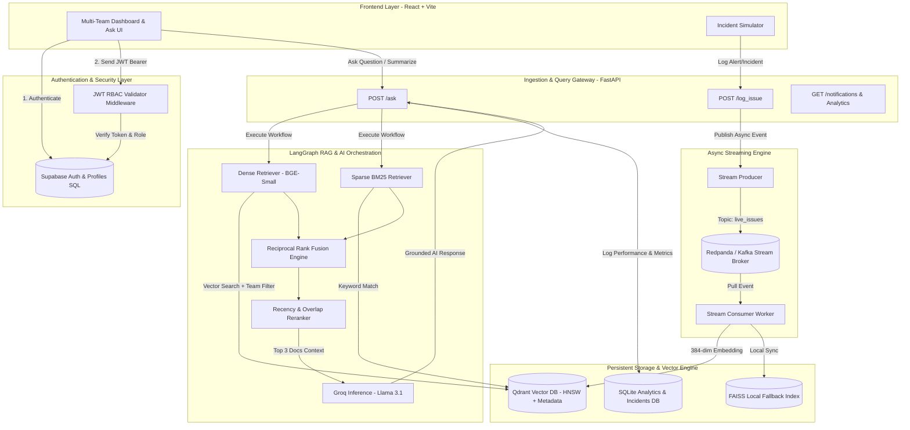
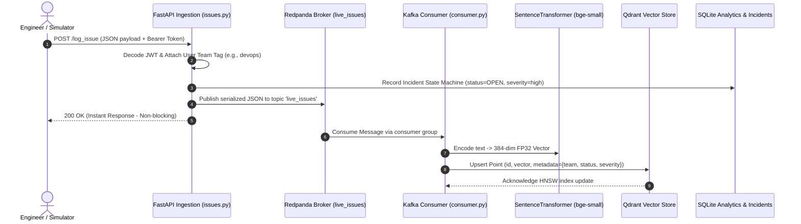
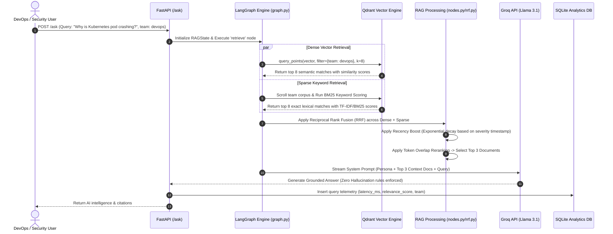
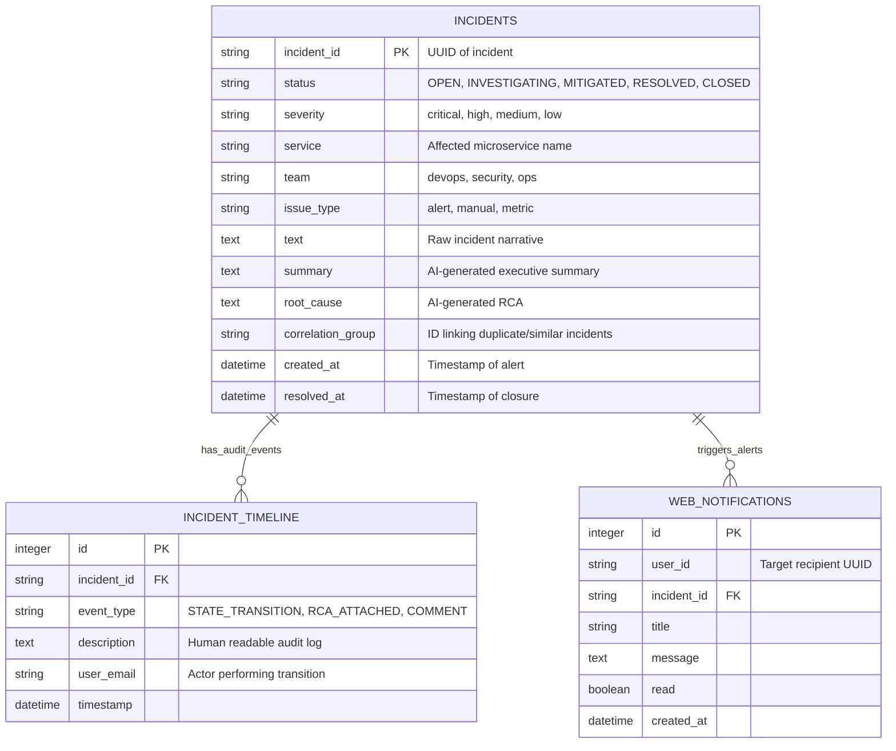

# Real-Time RAG: System Architecture & Data Flows

This document provides a deep, production-level architectural overview of the **Real-Time RAG Incident Intelligence Platform**. It is designed for System Design rounds and architectural presentations during engineering interviews.

---

## 1. High-Level Architecture Overview

The Real-Time RAG platform bridges the gap between **asynchronous operational data streams** and **synchronous AI decision support**. Traditional RAG pipelines rely on static, scheduled indexing runs (e.g., nightly batch vectorization). In cloud operations and cybersecurity, an incident occurs and resolves within minutes; delayed vectorization results in LLM hallucination or stale operational intelligence. 

This platform decouples **ingestion/indexing** from **retrieval/inference** using a scalable, micro-service style streaming pattern built around **Kafka/Redpanda**, **Qdrant Vector Engine**, **LangGraph Orchestration**, and **FastAPI**.



---

## 2. Component Design & Decoupled Architecture

### Why Decouple Ingestion from Querying?
In high-throughput operational environments (e.g., thousands of microservices emitting alerts and APM metrics), locking a vector database during synchronous REST calls would cause massive API degradation and timeout cascades.

1. **Ingestion Gateway (`POST /log_issue`)**: Acts solely as an **event publisher**. It performs schema validation and RBAC validation, appends user team tags, and publishes a JSON payload to the Redpanda Kafka topic (`live_issues`). Sub-millisecond latency is preserved because no ML embedding generation or indexing happens on the HTTP request thread.
2. **Streaming Consumer (`stream/consumer.py`)**: A persistent background worker that subscribes to `live_issues`. It pulls messages in batches, computes 384-dimensional dense vectors using **Hugging Face BAAI/bge-small-en-v1.5** on the worker thread, and inserts points into **Qdrant** with keyword-indexed metadata payloads.
3. **Query Engine (`POST /ask`)**: When an analyst requests situation awareness, the request skips stream brokers and hits the **LangGraph** RAG engine directly, executing parallel queries against Qdrant's indexed vectors and metadata schemas.

---

## 3. End-to-End Data Flows

### A. Ingestion & Vector Indexing Flow



### B. Hybrid RAG Retrieval & AI Generation Flow



---

## 4. Database & Vector Storage Schemas

The platform maintains strict architectural boundaries by using specialized data engines for distinct access patterns:
* **Supabase (PostgreSQL)**: Identity and Access Management (IAM), User Profiles, and RBAC constraints.
* **Qdrant Vector DB**: High-dimensional vector similarity indexing with payload filtering.
* **SQLite (`rag_analytics.db`)**: High-speed local relational tracking of incident state transitions, analytics telemetry, and notifications.

### A. Supabase Profiles Schema (`public.profiles`)
Enforces team scoping and strict architectural role hierarchies in PostgreSQL via triggers and Check Constraints.
```sql
CREATE TABLE public.profiles (
    id UUID PRIMARY KEY REFERENCES auth.users(id) ON DELETE CASCADE,
    email TEXT UNIQUE NOT NULL,
    role TEXT DEFAULT 'analyst' NOT NULL,
    team_name TEXT DEFAULT 'devops' NOT NULL,
    created_at TIMESTAMP WITH TIME ZONE DEFAULT timezone('utc'::text, now()) NOT NULL,
    
    -- Strictly enforced RBAC Roles Check Constraint
    CONSTRAINT profiles_role_check CHECK (
        role IN ('analyst', 'engineer', 'sre', 'team_lead', 'admin')
    ),
    
    -- Team Domain Isolation Constraint
    CONSTRAINT profiles_team_check CHECK (
        team_name IN ('devops', 'security', 'ops')
    )
);
```

### B. Qdrant Vector Point Schema (Collection: `incidents`)
Vectors in Qdrant are structured as `PointStruct` instances. To enable ultra-fast hybrid pre-filtering before cosine calculations, all metadata fields are explicitly formatted with **Keyword Payload Schema Indexing**.

```json
{
  "id": 1,
  "vector": [0.034, -0.128, 0.542, "...", "-0.012"], 
  "payload": {
    "text": "Kubernetes pod for search-index in CrashLoopBackOff state after 10:00 AM rollout.",
    "team_tag": "devops",
    "issue_id": "8e3b2f91-da1a",
    "status": "OPEN",
    "severity": "high",
    "service": "search-index-service",
    "timestamp": "2026-08-01T11:20:15.123456"
  }
}
```

### C. Relational Lifecycle & Analytics Schema (`rag/core/incidents.py` & `analytics.py`)



---

## 5. Security & Team Data Isolation (RBAC & Multi-Tenancy)

A paramount concern in operational platforms is data confidentiality: **A DevOps SRE must never have unfettered access to active Security breach investigations or employee data exfiltration alerts** unless explicitly authorized.

1. **Cryptographic Identity via Supabase JWT**: Every request to FastAPI must supply a signed Supabase JSON Web Token (`Bearer eyJhbGciOi...`).
2. **Middleware Verification (`app/auth.py`)**: FastAPI middleware interceptors authenticate the JWT against Supabase's JWKS endpoints and extract user profile claims (`email`, `role`, `team_name`).
3. **Hard Vector Pre-Filtering**: When the user initiates a search or AI query, their `team_name` (e.g., `security`) is hardcoded directly into the Qdrant query filter:
   ```python
   query_filter = Filter(must=[FieldCondition(key="team_tag", match=MatchValue(value=user.team_name))])
   ```
   *This ensures zero cross-team data leakage at the database engine level prior to any similarity search or LLM context injection.*
4. **Endpoint Role Authorization (`app/rbac.py`)**: Critical operational endpoints employ FastAPI dependencies to reject unprivileged roles:
   * `POST /admin/reset_db` -> Restricted to `['admin']`
   * `POST /incidents/{id}/transition` -> Restricted to `['engineer', 'sre', 'team_lead', 'admin']` (Basic analysts can view/query, but cannot alter state machines).
